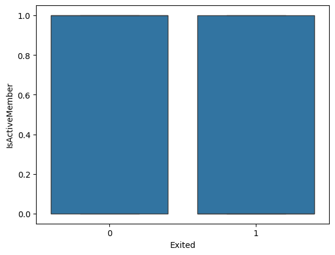

# Bank Churn Analysis

## 1. Data Exploration

### a. Initial Steps

- **Data Loading**
  - First, I loaded the dataset using Pandas Library and looked at the first few samples.

    

- **Data Types**:
  - I examined the data types of each column to understand what kind of data I am working with. Here is a screenshot of the data types:

    

- **Summary Statistics**: 
  - Then, I checked the **maximum**, **minimum**, and **mean** values of all the **numeric columns**. Here is a screenshot of the summary statistics:

  

### b. Correlation and Feature Analysis

- **Correlation Analysis**: 

  - A **heatmap** was plotted to visualize the correlation among various features and identify any multicollinearity.
  
  

- **Boxplots**:

  - **Boxplots** were used to detect any outliers and further explore the distribution of numerical variables.
  
  
  
  
  
  
  
  
  
  

### c. Categorical Feature Analysis

- **Barplots**:

  - **Barplots** were plotted to explore categorical features and analyze the proportion of customers who exited the company.
  
  
  
